# AI Team Structure: Thirty One Lab

As a **Sublimation Sales Agent** and an expanding digital entity, your business relies on a robust combination of human creativity (for physical apparel design) and AI efficiency (for systems, web design, finance, and marketing).

Here is the finalized AI agent structure perfectly aligned with your 4 core operational profiles:

## AI Organization Chart (Master Blueprint)

```mermaid
graph TD
    Company[Thirty One Lab] --> K[Financial Team]
    Company --> W[Web Developer Team]
    Company --> D[Web UI/UX Designer Team]
    Company --> M[Marketing Team]

    %% Financial Team
    K --> K1(Quotation Specialist)
    K --> K2(Margin & Profit Manager)
    K --> K3(Invoice & Tracking Manager)
    K --> K4(Certified Bookkeeper & Accountant)

    %% Web Developer Team
    W --> W1(Frontend Specialist)
    W --> W2(Backend & DB Architect)
    W --> W3(Lead Systems Architect & QA)

    %% Web UI/UX Designer Team
    D --> D1(Lead UI/UX Architect)
    D --> D2(Frontend Visual Designer)
    D --> D3(Digital Asset Creator)

    %% Marketing Team
    M --> M1(B2B Outreach Specialist)
    M --> M2(Meta/Google Ads Specialist)
    M --> M3(Portfolio & Testimonial Manager)
    
    classDef main fill:#8E44AD,stroke:#732D91,stroke-width:2px,color:#fff;
    classDef team fill:#2C3E50,stroke:#2C3E50,stroke-width:2px,color:#fff;
    classDef role fill:#ECF0F1,stroke:#BDC3C7,stroke-width:1px,color:#333;
    
    class Company main;
    class K,W,D,M team;
    class K1,K2,K3,K4,W1,W2,W3,D1,D2,D3,M1,M2,M3 role;
```

## Specialization Breakdown (Finalized Roles)

### 1. Financial Team (Apparel Core Focus)
Manages the internal cash flow, strict pricing rules, and invoicing for the sublimation business.
* **Quotation Specialist:** Calculates bulk custom apparel prices rapidly using the Sublimation Price Matrix.
* **Margin & Profit Manager:** Ensures every physical order maintains a minimum 25% net profit margin after advertising and operational costs.
* **Invoice & Tracking Manager:** Enforces flexible deposits but strictly enforces 100% full payment before pickup/delivery. Tracks factory shipments.
* **Certified Bookkeeper & Accountant:** Maintains the general ledger and automatically generates monthly P&L statements for tax compliance.

### 2. Web Developer Team (Systems & Code)
Responsible for maintaining current repositories (`thirtyonelab.catalog` & `thirtyonelab.invoice`) and architecting entirely new projects.
* **Frontend Specialist (UI/UX Code Builder):** Writes the actual Vite/React code to make the websites functional and fast.
* **Backend & DB Architect:** Manages the Supabase SQL schema, data logic, and server endpoints.
* **Lead Systems Architect & QA:** Evaluates the tech stack for new requested projects and acts as the final gatekeeper (testing builds before deployment).

### 3. Web UI/UX Designer Team (Digital Aesthetics)
Strictly focused on the digital wrapper (websites/banners). Leaves physical shirt designs to your human employees.
* **Lead UI/UX Architect:** Plans the user journey, wireframes, and custom order forms. Documents all styling rules in `design-system-prompt.md`.
* **Frontend Visual Designer:** Chooses color palettes and premium aesthetics to ensure human-designed mockups look expensive when displayed on the web.
* **Digital Asset Creator:** Designs web banners (e.g., 'Merdeka Sale') and optimizes UI icons/images for the frontend.

### 4. Marketing Team (B2B Lead Generation)
Focuses on capturing group orders (schools, corporate) and building a strong online reputation.
* **B2B Outreach Specialist:** Writes high-converting cold emails and WhatsApp scripts to secure bulk order inquiries.
* **Meta/Google Ads Specialist:** Runs ad campaigns targeting team captains and event organizers to generate leads for Quotations (not retail "Add to Cart").
* **Portfolio & Testimonial Manager:** Collects photos of printed shirts from the factory and curates 5-star testimonials into case studies on the website.
