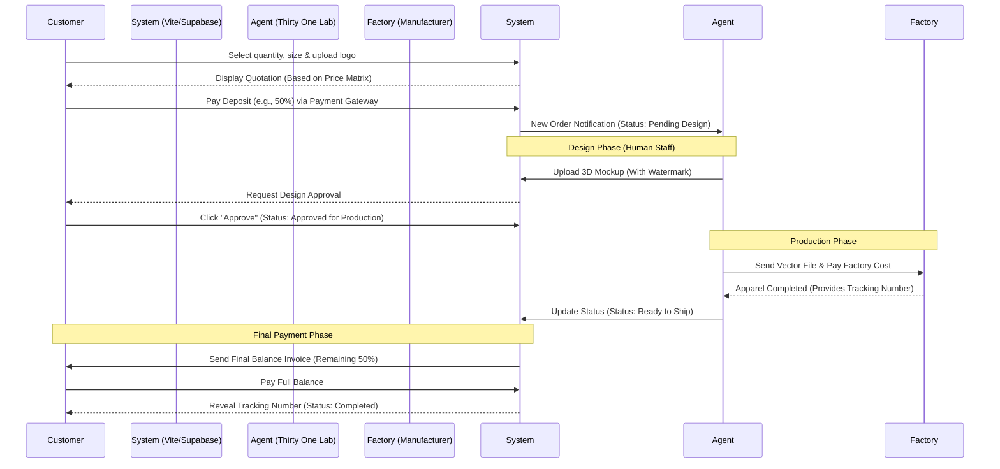

# Financial Workflow Architecture (Web System)

As a Web Developer, you need to translate real-world business processes into database logic (Supabase) and frontend interfaces (Vite). 

Below is the complete guide on how the money flow and order statuses should be designed in your code/system.

---

## 1. System Flow Sequence Diagram

---

## 2. Translating to "Coding" (Supabase Database)

To build the flow above, the `orders` table in your Supabase database must have data columns such as:

### Order Table Structure (`orders`)
* `order_id` (UUID) - Unique order ID.
* `total_price` (Decimal) - Total overall price (e.g., RM1,000).
* `deposit_amount` (Decimal) - Total deposit paid (e.g., RM500).
* `balance_due` (Decimal) - Remaining balance to be paid (e.g., RM500).
* `payment_status` (Enum) - `UNPAID` / `PARTIAL` (When deposit is received) / `PAID` (Fully settled).
* `order_status` (Enum) - Refer to the phases below.

### Order Status Logic (`order_status`)
You must build functions in your code so the system progresses in this exact sequence:
1. **`DRAFT`**: Client is filling out the pricing form on `thirtyonelab.catalog`.
2. **`AWAITING_DEPOSIT`**: Client agreed to the price, waiting for payment to clear.
3. **`PENDING_DESIGN`**: Deposit received. Human staff starts drawing/tracing.
4. **`DESIGN_APPROVAL`**: Staff uploads mockup, waiting for client to click approve.
5. **`IN_PRODUCTION`**: Client approved, file is handed over to the factory.
6. **`AWAITING_BALANCE`**: Factory has finished production, waiting for client to pay the balance.
7. **`SHIPPED`**: Balance paid, system automatically sends tracking number to the client.

### Accounting Table Structure (`ledger_entries`)
To support the Certified Bookkeeper AI, you must have a separate table to record actual cash flow:
* `entry_id` (UUID) - Unique transaction ID.
* `order_id` (UUID) - Linked to the `orders` table.
* `transaction_type` (Enum) - `INCOME` (Client deposit/balance) / `EXPENSE` (Factory payment / Server cost).
* `amount` (Decimal) - The money moved.
* `recorded_at` (Timestamp) - Date for monthly P&L sorting.

---

## 3. Money Flow (For Your Understanding)
* **Money In:** All client payments (Deposit & Balance) go directly into your company's account (Thirty One Lab) via ToyyibPay / Stripe / Billplz in the web system.
* **Money Out (Costs):** After the client approves the design, you (manually or via system) will transfer money to the factory to pay the order cost for the Finished Goods. Remember, your company is a Sales Agent, so you do not purchase or manage raw materials (fabric/ink).
* **Bank Balance:** The money left in your account after deducting the factory payment and payment gateway fees is your **Net Profit Margin**.
